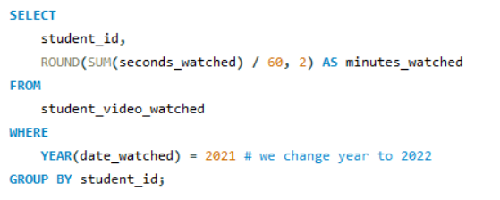
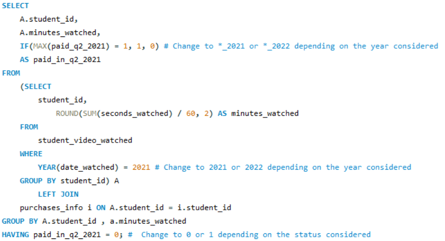
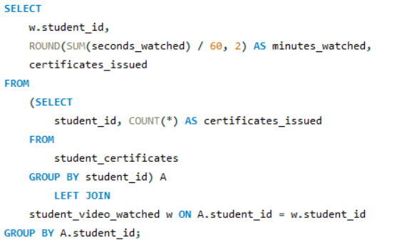
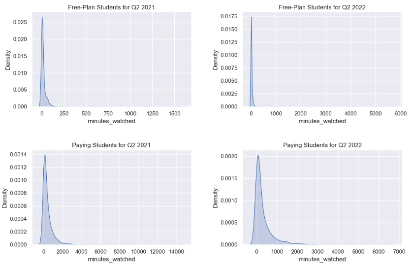
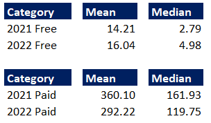
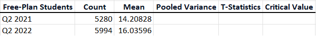
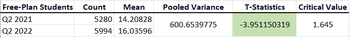
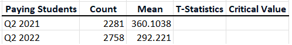
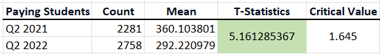

# Tracking User Engagement : Project Overview
The objective of this project is to analyze and determine whether the new additions to the platform (new courses, exams, and career tracks) have increased student engagement between Q2 2021 and Q2 2022

- Leveraged SQL queries to retrieve relevant data from the database which was then exported as CSV files for subsequent analysis
- Examined the data distribution of key variables and addressing outliers to minimize potential skewness, and subsequently saved the cleaned datasets as CSV files for furthur analysis
- Calculated 95% confidence intervals to understand the likely range of user engagement (minutes watched) for free and paying students in Q2 2021 and Q2 2022. Additionally, hypothesis testing was conducted to evaluate if the average watch time significantly increased for both segments between these two quarters
- Calculated the correlation between minutes watched and certificates issued to find out if longer engagement means more certificates
- Determined if watching a lecture in Q2 2021 and Q2 2022 are dependent or independent events. and calculated the probability of a student watching a lecture in Q2 2021, given they watched one in Q2 2022
- Built a model to predict number of certificates issued based on the total minutes watched

## Table of Contents
- [Inroduction](#Inroduction)
- [Project Requirements and Prerequisites](#Project-Requirements-and-Prerequisites)
- [Methodology](#Methodology)
  - [1 Data Preparation with SQL](#1-Data-Preparation-with-SQL)
  - [2 Data Preprocessing with Python](#2-Data-Preprocessing-with-Python)
  - [3 Data Analysis with Excel](#3-Data-Analysis-with-Excel)
  - [4 Dependencies and Probabilities](#4-Dependencies-and-Probabilities)
  - [5 Data Prediction with Python](#5-Data-Prediction-with-Python)
- [Conclusion](#Conclusion)

## Inroduction
Welcome! This project, "Tracking User Engagement with SQL, Excel, and Python" part of the 365datascience projects, aims to analyze and determine whether new additions(new courses, exams, and career tracks) have increased student engagement between Q2 2021 and Q2 2022 – new additions include enrolling in career tracks, testing knowledge through practice, course, and career track exams, and an expanded course library. By comparing different metrics, we can measure the effectiveness of these features and overall user engagement. The first half of 2022 was expected to be profitable for the company due to the hypothesized increase in student engagement following the release of these features on the website in late 2021.

## Project Requirements and Prerequisites
This project requires the following tools and software packages:

### Tools:
- `MySQL Workbench 8.0 (or later)`: Required for retrieving relevant data from the database
- `Microsoft Excel 2007 (or later)`: Required for performing hypothesis testing
- `Python 3`: Necessary for data analysis and prediction tasks

### Python Packages:
- `numpy`, `pandas`: For data manipulation and analysis
- `matplotlib`, `seaborn (optional)`: For data visualization
- `statsmodels`: For statistical modeling, and hypothesis testing
- `scikit-learn (sklearn)`: For performing linear regression and other machine learning tasks

### Cloning the Repository and Installing Python Dependencies:
1. Open terminal or command prompt and navigate to the directory where you want to store the project
```bash
cd directory_name
```

2. Run the code below to `clone the repository`
```bash
git clone https://github.com/Keshwar02/Tracking-User-Engagement-Using-SQL-Excel-and-Python.git
```

3. Navigate to the project directory. This is necessary so that subsequent commands(like installing dependencies) are executed within the context of the project
```bash
cd repository_name
```

4. Installing Python Dependencies
```bash
pip install numpy pandas matplotlib seaborn statsmodels scikit-learn
```

### Data:
- Execute the `initial_setup.sql` file in MySQL Workbench, which will create several tables required for our analysis. Then we write SQL queries to retrieve the specific data needed for our analysis from these tables.


## Methodology


### 1 Data Preparation with SQL
This part of the project aims to retrieve the relevant information from database for our analysis. This is achieved by writing SQL queries, we export the result-sets obtained as CSV files. These CSV files will be crucial for subsequent analytical tasks, such as calculating confidence intervals, performing hypothesis testing, and building a model

**Data Description**
- `student_certificates`: This table had following features-Holder(student ID) and issuance date of certificates issued in Q2 2022
- `student_info`: This table has following features-Student ID and registration date of students registered between January 1, 2020 and June 30, 2022
- `student_purchases`: This table has following features-student ID, product type, purchase date, and refund date(if applicable) of purchases mage between January 1, 2020 and June 30, 2022
- `student_video_watched`: This table has-student watching (student_id), time_watched, and date of course watched in Q2 2021 and Q2 2022
  
The data we currently have is not in a format that is suitable for our analysis. Therefore, we leverage MySQL's `CASE`, `IF` functions, `JOINS`, `GROUP BY`, `HAVING` clauses and views to fetch the relevant result-sets

#### 1. Creating a View:
- First step in data preparation stage is creating a view with the following columns. we'll use `student_purchases` table
   - `purchase_id`
   - `student_id`
   - `plan_id`
   - `start_date`
   - `end_date`
   - `paid_q2_2021`
   - `paid_q2_2022`
- We can leave the first three columns as it is no modifications are needed
- Rename the `date_purchased` to `start_date` for consistency with subsequent `date_end` column
- To calculate the `end_date`, add one month, three months, or 12 months to the `start_date` for a Monthly (represented as 0 in the plan_id column), Quarterly (1), or an Annual (2) purchase
- Re-calculate the `end_date` column if a refund occured, the subscription end date should be `refund_date` instead of calcualted `end_date`
- Creating two columns (i.e., paid_q2_2021 and paid_q2_2022) last 2 columns contain binary values indicating wheather a student had an active subscription during the respective year's second quater(April 1 to June 30, inclusive), A `0` in the column indicates a free-plan student in Q2, while a `1` represents an actve subscription in that period.

#### 2. Splitting into Periods:
Created a view in the schema called `purcahses_info`, which stores information about students subscriptions. Now we'll utilize `purchases_info` to classify students as free-plan and paying in Q2 2021 and Q2 2022

- First, we calculate total minutes watched in Q2 2021 and Q2 2022 seperately. also we want to identify which users were paid subscribers during each of these periods
  <p align=center>
    
  </p>
- Then, Create a 'paid' column to do this we join the above query with `purchases_info` view whcih we have created to classify users as free-plan and paid in Q2 2021 and Q2 2022. The result-set will have following columns:
- `student_id`
- `minutes_watched`
- `paid_in_q2`
- The last column indicates wheather a student had an active subscription in Q2 or not
  <p align=center>
    
  </p>
- By changing these 3 values `paid_q2_2021/2022`, `YEAR(date_watched) = 2021/2022`, and `paid_in_q2_2021 = 0/1`  we will obtain the following result-sets which we will export as CSV files
  - Students engaged in Q2 2021 who haven’t had a paid subscription in Q2 2021 (minutes_watched_2021_paid_0.csv)
  - Students engaged in Q2 2022 who haven’t had a paid subscription in Q2 2022 (minutes_watched_2022_paid_0.csv)
  - Students engaged in Q2 2021 who have been paid subscribers in Q2 2021 (minutes_watched_2021_paid_1.csv)
  - Students engaged in Q2 2022 who have been paid subscribers in Q2 2022 (minutes_watched_2022_paid_1.csv)


#### 3. Certificates Issued:

We have succesfully retrieved the data necessary for calculating confidence interval of average minutes watched for free-plan and paid users in Q2 2021 and Q2 2022, hypothesis testing, and Assessing Event Dependencies and calculating probabilities. 

Now we'll retrieve information on minutes watched and certificates issued to students. We'll study the correlation between these two metrics. and use this data to build a regression model. This is the final part of data preparation or extraction task

- For this, we consider only the students who've been issued a certificate. We extract the following information for each student:
  - `student_id`
  - `total_minutes_watched`
  - `total_no_of_certificates_issued`
- First, we create a sub-query that aggregates the number of certificates each student has been issued and store them in column called `certificates_issued`
- Then, join the sub-query with the `student_video_watched` table and select all the records from sub-query, and calculate the number of minutes watched and store the result in a column called `minutes_watched`
  <p align=center>
    
  </p>


### 2 Data Preprocessing with Python
We have successfully extracted the data necessary for our analysis. 

This part of the project focuses on data cleaning and preprocessing. We will examine the data for inconsistencies and address them. A key issue identified is the right skewness, indicating the presence of outliers. Effectively handling these outliers is crucial as they can distort statistical tests and regression model.

#### 1. Plotting the distributions
<p align=center>
  
</p>

#### 2. Removing the outliers
- We remove outliers by keeping the data below 99th percentile
- With the help of conditional filtering, we can remove outliers based on quantile values
```python
df1 = df1[df1['minutes_watched']<df1_99_quantile]
df2 = df2[df2['minutes_watched']<df2_99_quantile]
df3 = df3[df3['minutes_watched']<df3_99_quantile]
df4 = df4[df4['minutes_watched']<df4_99_quantile]
```
Once we've retrived the final datasets, we save them as four seperate CSV files
```python
df1.to_csv('minutes_watched_2021_paid_0_no_outliers.csv',index=False)
df2.to_csv('minutes_watched_2022_paid_0_no_outliers.csv',index=False)
df3.to_csv('minutes_watched_2021_paid_1_no_outliers.csv',index=False)
df4.to_csv('minutes_watched_2022_paid_1_no_outliers.csv',index=False)
```
We're done with Data Extraction and Data Preprocessing.

### 3 Data Analysis with Excel
In this part, we calculate confidence intervals of "average minutes watched" for "free and paid" users in "Q2 2021 and Q2 2022" and perform hypothesis to verify wheather there's a statistically significant differnce in student engagement between Q2 2021 and Q2 2022

#### 1. Calculating Mean and Median 

We compare these metrics to see how engagement changed from Q2 2021 to Q2 2022 for free-plan and paying students

<p align=center>
  
</p>

- For free-plan students who watched in Q2 2021, the mean minutes watched are significantly higher than the median. This suggests a right-skewed distribution, indicating that a few students watched much more than others
- A similar situation is observed for free-plan students who watched in Q2 2022, with the mean being higher than the median, indicating right skewness
- The same applies to paying students who watched in Q2 2021 and those who watched in Q2 2022, where the mean is higher than the median, indicating right skewness

#### 2. Calculating Confidence Intervals
1. Determine the size of sample(n)
2. Calculate sample standard deviation
3. Calculate the standaed error (SE): Divide standard deviation by the sqrt of sample size
4. Calculate the margin of error(MoE): critical value for a 95% confidence interval is 1.96. Multiply this by standard error(SE)
5. Calculate the confidence interval(CI): `Mean - MoE` for lower bound and `Mean + MoE` for upper bound

#### 3. Performing Hypothesis Testing

Hypothesis testing helps us objectively determine whether the observed differences in engagement are due to the new features or if they occurred by chance. By analyzing this, we can make data-driven decisions about whether the new platform features were effective in increasing student engagement.

1. **Formulate Null and Alternative Hypotheses**
   - **Null Hypothesis(Ho):** The engagement in Q2 2021 is higher than or equal to the one in 2022
   - **Alternative Hypothesis(H1)**: The engagement in Q2 2021 is lower than the one in Q2 2022

2. **Perform t-test**
   - There are 2 ways to do this
     1. Excel's built-in t-test from Analysis Toolpack or
     2. Doing manually
   - We will do it manually
     
**For Free-plan students**

  <p align=center>
   
  </p>
  
- First, calculate the pooled variance
- Then, calculate the t-statistic(formula for t-statistic in a two-sample t-test with equal variances)
- Lookup for the critical t-value
- Compare t-statistic to critical value
  
  <p align=center>
    
  </p>
  
As the t-statistic is less than the critical value we reject the null hypothesis. This is because the negative t-statistic indicates that (the mean minutes watched by students in Q2 2021) is significantly smaller than (the mean minutes watched by students in Q2 2022)

**For Paying students**

  <p align=center>
    
  </p>
  
- Calculate the t-statistic (where the variances are assumed unequal)
- Lookup for critical value
- Compare t-statistic to critical value
  <p align=center>
    
  </p>

As the t-statisticis greater than the critical value we fail to reject the null hypothesis. This means there’s not enough evidence to conclude that μ1 is smaller than μ2. So, the data 
supports the null hypothesis that μ1 is larger than or equal to μ2.

### 4 Dependencies and Probabilities


### 5 Data Prediction with Python
This is the Final part of the project, here we build a model 

## Conclusion


